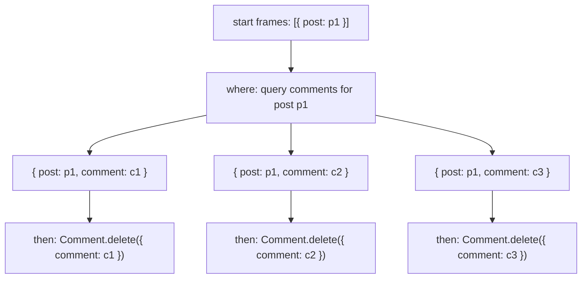

# Concept design: concepts and synchronizations

This repository is a minimal skeleton for building applications using concept
design (inspired by Daniel Jackson's "The Essence of Software"). The system is
composed of:

- Concepts: small, independent modules that encapsulate a single purpose and
  state, exposed only via actions and read-only queries.
- Synchronizations: declarative rules that compose actions across concepts using
  when/where/then.

The goal is modularity and clarity: each concept stands alone, and composition
happens explicitly in synchronizations.

## Motivation

- Explicit boundaries: concepts never import one another; composition is
  declarative.
- Testable units: concepts and synchronizations can be tested in isolation.
- Predictable flow: synchronizations group causally related actions into a
  single flow for reasoning and debugging.
- These properties are intended to enable more confident evolution of codebases,
  especially in tandem with a language agent, as all changes can be isolated and
  versioned without affecting the rest of the system.

## LLM Compatibility

- This directory contains a detailed set of documentation about the approach,
  formatted as system prompts and specifically Cursor Rules, located in
  `.cursor/rules`.
- These rules lean into the idea of shared Human and AI context, and also serve
  as documentation for the approach.
- For non-Cursor users, refer models to this directory, or copy-paste as system
  prompts. All files are formatted as basic markdown.

## Current Platform

- Language: TypeScript.
- Concepts are TS classes, synchronizations are functions that specify behavior
  using a small set of declarative helpers.
- Import helpers and types from `./engine/mod.ts`.
- (Optional) runtime: Deno, which simplifies imports and build steps. If you'd
  like to use anything else, simply remove `.vscode` (settings to enable Deno)
  and edit `./cursor/rules/platform.mdc` with the details of your preferred
  runtime and platform choices.

## Directory layout

```
<project-root>/
├─ specs/     # Concept specifications (.concept)
├─ concepts/  # `${Name}Concept` classes (actions + read-only queries)
├─ syncs/     # Synchronization functions (when/where/then)
├─ engine/    # Runtime (import via `engine/mod.ts`)
└─ example.ts # Minimal wiring of concepts + synchronizations
```

## Concepts

Specification (in `.concept`) describes purpose, state, actions, and possible
outcomes (including errors as ordinary outputs).

Implementation requirements:

- One class per concept named `${Name}Concept` in `concepts/`.
- No cross-imports between concepts.
- Actions: methods with exactly one input object and one output object. Shapes
  must match the spec.
- Errors are ordinary outputs (e.g., `{ error: string }`).
- Query functions for reads only:
  - Method name starts with `_`.
  - One input object.
  - Returns an array of output objects (to support fan-out in synchronizations).

Example action signature (shape, not implementation):

```ts
register(input: { user: string; name: string; email: string }):
  | { user: string }
  | { error: string };
```

## Synchronizations

Synchronizations are TypeScript functions that declare how concept actions
compose. They return an object with `when`, optional `where`, and `then`.

### when — observe completed actions

- Matches one or more completed actions inside the same causal flow (a flow is
  started by an external call and propagates through triggered actions).
- Each pattern is `[InstrumentedAction, inputPattern, outputPattern]`.
- Use variables from `Vars` to bind values from inputs/outputs.
- Multiple patterns in `when` act like a join over the same flow: only
  occurrences that co-occur in that flow (and whose patterns are compatible)
  proceed.

Scenario: deleting a post triggers cascade deletion of its comments.

Example (bind `post` and join with the initiating API request in the same flow):

```ts
when: actions(
  // External trigger: DELETE /posts/:id → bind `post`
  [API.request, { method: "DELETE", path: "/posts/:id", id: post }, {
    request,
  }],
  // Effect that occurred in this flow and must also match
  [Post.delete, { post }, { post }],
);
```

Declaring variables with `Vars` (function skeleton):

```ts
const DeleteComments = ({ post, request }: Vars) => ({
  when: actions(
    [API.request, { method: "DELETE", path: "/posts/:id", id: post }, {
      request,
    }],
    [Post.delete, { post }, { post }],
  ),
  // ... where / then
});
```

### Frames — execution contexts for composition

- A `Frame` is a mapping from variables (symbols) to concrete values for one
  candidate execution.
- `Frames` is a thin array-like container of frames. It supports query and
  filtering while preserving the set-of-possibilities model.
- Fan-out produces multiple frames (e.g., querying “all comments” yields one
  frame per comment).

Visual fan-out (scenario: when a post is deleted, delete all its comments):



### where — refine and enrich frames (pure)

- Signature: `(frames: Frames) => Frames`.
- Use `frames.query(Concept._query, inputPattern, outputPattern)` to enrich
  frames with additional bindings. Queries are read-only and may expand to many
  frames.
- Use standard array-style filters/maps to constrain frames to those that should
  continue.

Example (fan-out over related entities; pairs with the fan-out diagram):

```ts
// Delete all comments for a post when the post is removed
const DeleteComments = ({ post, comment, request }: Vars) => ({
  when: actions(
    [API.request, { method: "DELETE", path: "/posts/:id", id: post }, {
      request,
    }],
    [Post.delete, { post }, { post }],
  ),
  where: (frames: Frames) =>
    frames
      .query(Comment._getByTarget, { target: post }, { comment }),
  then: actions([Comment.delete, { comment }]),
});
```

> Commentary: Why isn't the `when` triggered on just the post deletion? In fact,
> you'd generally prefer to do this as it's more modular, and enables the
> behavior of maintaining comment deletion _regardless_ of how the post deletion
> occurred. This example is mainly used to highlight that synchronizations
> enable you to condition on multiple actions. There is, however, a specific use
> case in which you'd want to specify this version: imagine that you actually
> want to preserve the manual ability to delete posts while leaving comments
> alone, due to a migration issue or data corruption. This synchronization would
> then only fire when specifically user initiated through the API, and calling
> `Post.delete` directly won't automatically try to delete comments.

As `Frames` are just an extension of `Array`, the following example uses
`.filter` to constrain the notification to happen only after the counter is
above 10:

```ts
const NotifyWhenReachTen = ({ user, count }: Vars) => ({
  when: actions(
    [Button.clicked, { kind: "increment_counter", by: user }, {}],
    [Counter.increment, {}, {}],
  ),
  where: (frames: Frames): Frames =>
    frames
      .query(Counter._getCount, {}, { count })
      .filter(($) => $[count] > 10),
  then: actions(
    [Notification.notify, { message: "Reached 10", to: user }],
  ),
});
```

In this case, `$` is referring to the frames, and you may directly access the
expected binding using declared variables like `count`. Additionally, typing is
preserved after binding `count` from the previous `query`, and the lambda in the
filter will automatically infer the type of `$[count]` based on the output
arguments of `Counter._getCount`, which is `number` in this case.

### then — emit side-effecting actions

- Specifies actions to invoke for each remaining frame.
- Each item is `[InstrumentedAction, inputPattern]` (no output pattern —
  invocation, not matching).
- Deterministic fan-out: one invocation per frame per listed action.

Example:

```ts
then: actions(
  [Notification.notify, { message: "Reached 10" }],
);
```

## Wiring: engine, concepts, and syncs

```ts
import { actions, Frames, SyncConcept, Vars } from "./engine/mod.ts";

// 1) Initialize engine and instrument concepts
const Sync = new SyncConcept();
const concepts = {
  // SomeConcept: new SomeConcept(),
};
const instrumented = Sync.instrument(concepts);
// Destructure as needed from `instrumented` to get instrumented actions
// const { SomeConcept, OtherConcept } = instrumented

// 2) Define synchronizations
const ExampleSync = ({}: Vars) => ({
  when: actions(
    // [SomeConcept.someAction, { ...match inputs... }, { ...match outputs... }],
  ),
  // where: (frames: Frames) => frames.query(SomeConcept._someQuery, { ... }, { ... }),
  then: actions(
    // [OtherConcept.otherAction, { ...inputs... }],
  ),
});

// 3) Register synchronizations
Sync.register({ ExampleSync });

// 4) Call instrumented actions to trigger syncs
// SomeConcept.someAction({ ... });
```

See `example.ts` for a complete, runnable example.

## Debugging

Set logging on the engine to trace flows and matches:

```ts
import { Logging } from "./engine/mod.ts";
// ... after creating Sync
// Sync.logging = Logging.TRACE;   // summary of actions
// Sync.logging = Logging.VERBOSE; // detailed provenance
```

### License

Copyright (c) MIT CSAIL. All rights reserved.

This project is licensed under the Creative Commons
Attribution-NonCommercial-ShareAlike 4.0 International.

- SPDX: CC-BY-NC-SA-4.0
- https://creativecommons.org/licenses/by-nc-sa/4.0/
